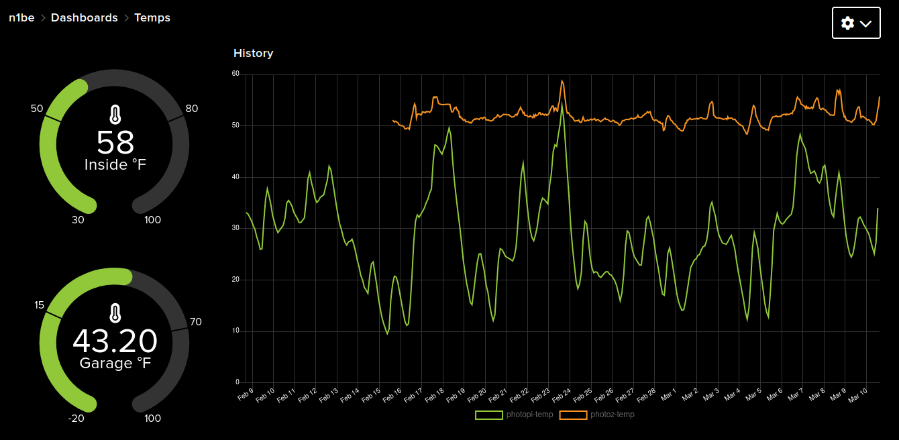
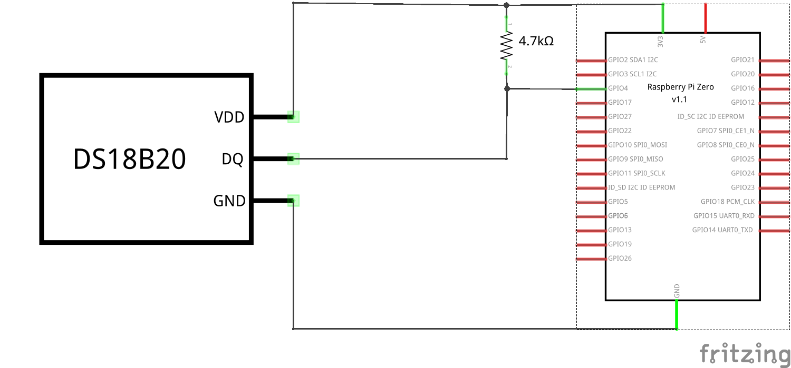

# iot_temp
This program monitors ambient temperature with a 1-wire sensor and reports the value to a *feed* on [Adafruit IO.](https://io.adafruit.com/)  Feeds provide the data that can be displayed on an AIO Dashboard.  For example, this image shows two temperature feeds on a dashboard with guages showing the current reading and graphs showing history of readings:

## Hardware
- **Controller:** Raspberry Pi (any model).  This application uses minimal resources. Even a Pi-Zero can cuncurrently run a web cam, etc.
- **Sensor:** DS18B20 Digital temperature sensor [Adafruit 374](https://www.adafruit.com/product/374)

## Schematic
The original schematic is in file `schematic.fzz`.  This has been exported from fritzing to `schematic.png` shown here:

This design comes from [Adafruit's Raspberry Pi Lesson 11. DS18B20 Temperature Sensing](https://learn.adafruit.com/adafruits-raspberry-pi-lesson-11-ds18b20-temperature-sensing)

## 1-wire Device Driver
The default for the 1-wire driver, GPIO 4, is used by this circuit.  The circuit uses an external through-hole 4.7k pullup resistor.  (This resistor is supplied with the sensor.)  Therefore `/boot/config.txt` includes the following line to load the needed driver.  (See `/boot/overlays/README` on the Pi for variations like using a different GPIO or having the Pi provide pullup.)

    dtoverlay=w1-gpio

## Security Credentials
Adafruit IO (aio) requires two strings, _username_ and _key_, before you can connect.  These strings are not in the program source.  They must be provided via these environment variables, *IO_USERNAME* and *IO_KEY*.  Commands similar to this can be used to set those variables before running iot_temp:

    export IO_KEY="your_aio_key"
    export IO_USERNAME="your_aio_username"

## Program Activation
This program is intended to be started once and it runs continuously monitoring temperature.  The *crontab* of the default user, usually "pi", is used to start the monitor.  There is no automatic restart if the program aborts.  This could be managed by running the program under systemd instead of cron.

If there is a file, *secrets*, with commands like those above to set the environment variables needed for security credentials, this crontab line can be used to start the program automatically when the pi boots:

    @reboot      . ./secrets && ./iot_temp.py

